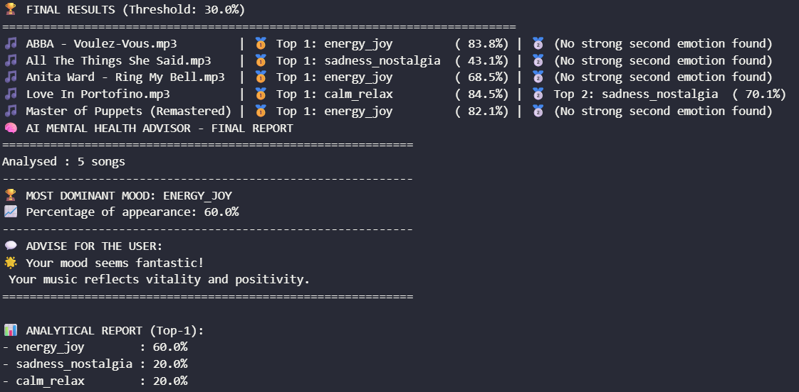
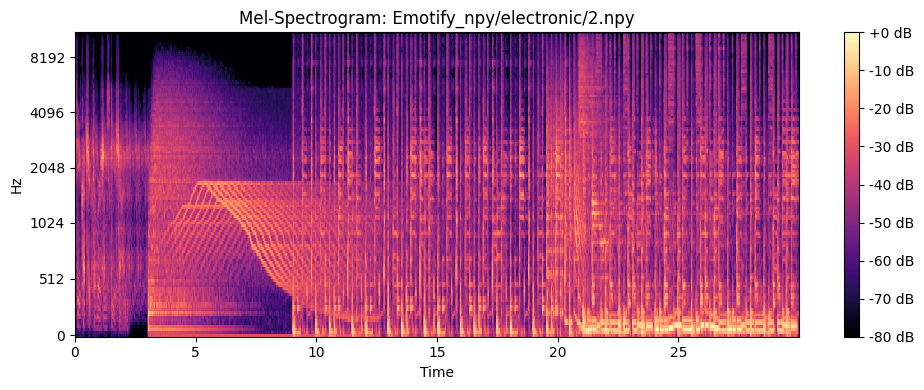
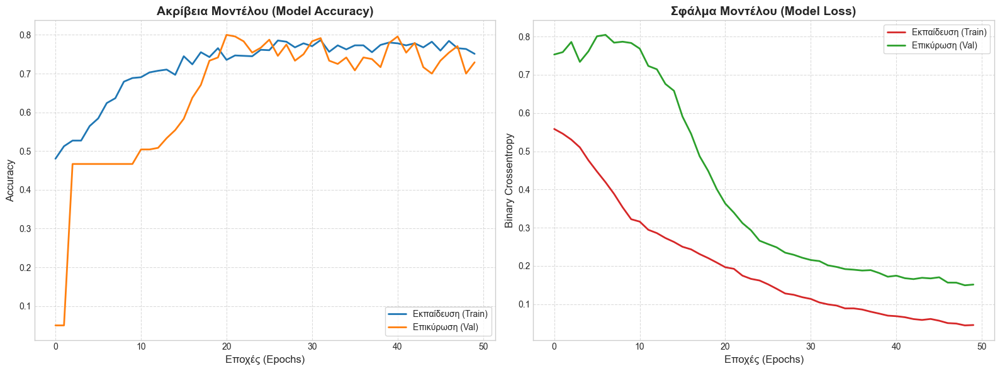
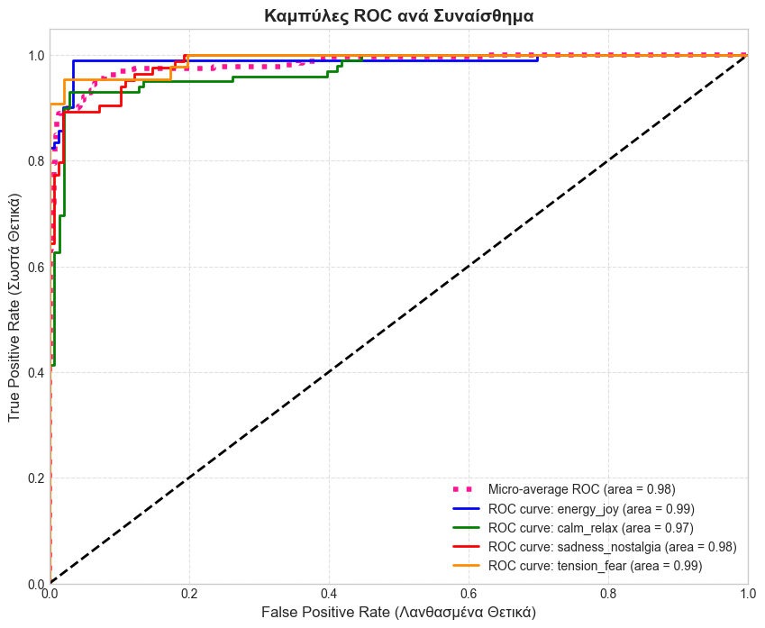

# CRNN-Music-Emotion-Recognition
CRNN-based Music Emotion Recognition system using the Emotify dataset. The model employs a hybrid CNN-GRU architecture with dynamic optimization for robust classification into four emotional states. Includes a CLI-based advisor to promote user mood regulation through automated playlist analysis. 

**Project Overview**

This project explores the "semantic gap" in music information retrieval by combining CNN layers for spatial feature extraction with GRU layers for temporal modeling. It features a CLI-based mental health advisor that analyzes user playlists to provide supportive prompts, aiming to assist in mood regulation.

**Example of a Mel-Spectogram**

**Key Features**

1.Hybrid Architecture: Combines Conv2D layers for feature extraction and GRU layers for sequential analysis.  
2.Dynamic Optimization: Implements EarlyStopping and ReduceLROnPlateau to ensure robust convergence and prevent overfitting.  
3.Advanced Preprocessing: Uses Librosa for Log-Mel Spectrogram extraction with Min-Max Scaling.  
4.Mental Health Intervention: A CLI-based tool that interprets emotional trends in playlists and triggers supportive feedback.

**Performance Metrics**

The model achieved an impressive weighted average F1-score of 0.92, demonstrating high robustness across all emotional classes. Below are presented the Final Learning-Loss Curve and ROC Curve for the epoch with the minimum Loss (Epoch 49)

**Requirements**

To run this project, ensure you have the following dependencies installed:
tensorflow
librosa
numpy
Pandas

**AI Transparency & Credits**

The development of this project, including the conceptual design, CRNN architecture, and analysis of results, is the product of personal research. Generative AI tools were utilized to assist with code optimization, debugging, and the formatting of this documentation.
